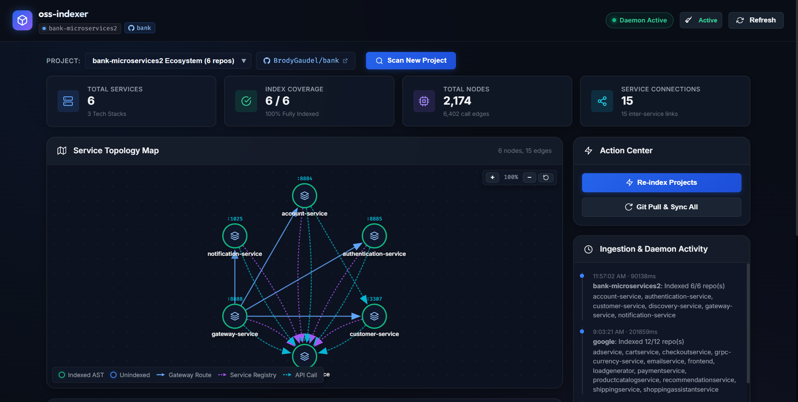
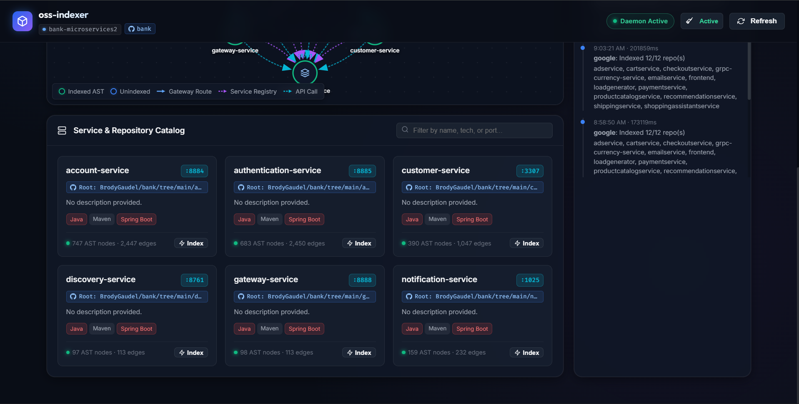

<div align="center">

# 📦 oss-indexer

**Autonomous Microservice Topology Control Plane, Interactive Whiteboard Architecture Canvas & Real-Time AST Knowledge Graph Daemon**

[](https://github.com/Abbilville/oss-indexer/releases)
[](https://golang.org/)
[](https://modelcontextprotocol.io/)
[](#-docker--container-deployment)
[](LICENSE)

<p align="center">
  <a href="#-quick-start">Quick Start</a> •
  <a href="#-connecting-ai-agents-via-mcp">MCP Setup</a> •
  <a href="#-mcp-tools-reference--ai-prompt-examples">MCP Tools</a> •
  <a href="#-web-dashboard-guide">Dashboard Guide</a> •
  <a href="#-authentication--security">Security & Auth</a> •
  <a href="#-cli-reference">CLI Reference</a> •
  <a href="#-private-repositories--git-sync">Git Sync</a> •
  <a href="#-docker--container-deployment">Docker</a>
</p>

</div>

---

<p align="center">
  
</p>
<p align="center">
  
</p>

---

## 🌟 What is oss-indexer?

Modern software projects often consist of multiple microservices, frontend applications, and shared libraries spread across polyrepos or monorepos.

When developers work with **AI coding assistants** (like Cursor, Claude Desktop, Antigravity IDE, or Cline), AI agents typically only see the current opened directory. They lack the high-level picture:
- *Which service communicates with which?*
- *What runtime port does the authentication service run on?*
- *Which services route through the API Gateway or register with Eureka / Consul?*
- *Are the AST code memory graphs for all microservices up to date?*

**`oss-indexer` solves this.** It runs as a lightweight, single-binary background daemon that:
1. **Deep-Scans Workspaces**: Automatically discovers all microservices, tech stacks (Go, Node.js, Python, Java Spring Boot, etc.), and assigned ports.
2. **Builds Interactive Topology Maps**: Renders an infinite-canvas whiteboard with directional routing arrows and curved non-overlapping Bezier lines.
3. **Ingests AST Graphs**: Integrates directly with [`codebase-memory-mcp`](https://github.com/DeusData/codebase-memory-mcp) to maintain Abstract Syntax Tree (AST) knowledge graphs and call hierarchies.
4. **Exposes MCP Tools**: Serves 9 standardized Model Context Protocol tools over Streamable HTTP and Stdio, empowering AI agents to query cross-service relationships, trace API hops, and trigger re-indexing on demand.

---

## ⚡ Key Highlights

| Feature | Description |
| :--- | :--- |
| 📋 **Whiteboard Architecture Canvas** | Infinite whiteboard canvas with drag-to-pan, mouse cursor zoom, draggable nodes, and bounded workspace perimeters. |
| 📌 **Canvas Layout Memory & Reset** | Saved node drag positions persisted in local storage across browser refreshes, with one-click **Reset Layout** button. |
| 🌈 **Non-Overlapping Multi-Edge Arcs** | Curved quadratic Bezier arcs prevent lines from stacking when multiple routes exist between the same pair of services. |
| 📊 **100% Project-Focused Metrics** | Real-time hero cards tracking `Total Services`, `Index Coverage`, `Total Nodes`, and `Service Connections`. |
| 🔍 **Native Folder Browser Dialog** | Integrated OS Explorer folder selection (`Browse...`) to effortlessly register local workspaces. |
| 🐙 **Git Origin & Source Tracing** | Automatically classifies whether a service originates from the Monorepo Root or an independent Service repo, with clean ellipsis truncation. |
| 🗑️ **GitHub-Style Project Deletion** | Safeguarded project removal requiring typing the exact `project_id` to confirm, with automatic AST graph cache purging. |
| 🔒 **API Token Auth & `.env` Support** | Built-in `.env` file loader, token-protected REST & MCP endpoints, with real-time status badges in the top navbar. |
| 🔄 **Git Pull & Automatic Sync** | One-click `Git Pull & Sync All` (fast-forward safe) to pull latest commits and re-index modified files into the knowledge graph. |
| ⚡ **Real-Time Live SSE Stream** | Watch background indexing jobs, warnings, and completions live on terminal stdout and the dashboard via Server-Sent Events (`/api/events`). |
| 🤖 **Standard MCP Server** | Connects seamlessly with Claude Desktop, Cursor, Antigravity IDE, Cline, and Continue via HTTP or Stdio. |

---

## 🚀 Quick Start

### 1. Prerequisites

- **Go (>= 1.25)**: To compile or run `oss-indexer`.
- **Node.js (>= 18)**: Required to use the AST memory graph engine.
- **codebase-memory-mcp**:
  ```bash
  npm install -g codebase-memory-mcp
  ```

---

### 2. Installation

#### Option A: Global Go Install (Recommended)
```bash
go install github.com/Abbilville/oss-indexer/cmd/oss-indexer@latest
```
*Installs `oss-indexer` directly to `$GOPATH/bin` so you can run it from any terminal.*

#### Option B: Build from Source
```bash
git clone https://github.com/Abbilville/oss-indexer.git
cd oss-indexer

# Linux / macOS
go build -o bin/oss-indexer ./cmd/oss-indexer

# Windows PowerShell
go build -o bin/oss-indexer.exe ./cmd/oss-indexer
```

---

### 3. Start the Daemon

```bash
# Start background daemon (automatically loads .env if present)
oss-indexer daemon
```

Terminal output:
```text
[oss-indexer] Daemon started (interval: 15m0s, auto-pull: true, mode: moderate)
[oss-indexer] Dashboard UI:    http://127.0.0.1:43770/
[oss-indexer] MCP HTTP Server: http://127.0.0.1:43770/mcp
[oss-indexer] Auth Status:     ENABLED (API & Dashboard require token)
```

Open your browser at **[http://localhost:43770/](http://localhost:43770/)**.

---

## 🤖 Connecting AI Agents via MCP

`oss-indexer` speaks the official [Model Context Protocol (MCP)](https://modelcontextprotocol.io/). You can connect it via **HTTP Stream** (when the daemon is running) or **Stdio** (standalone binary execution).

### 1. Cursor IDE

Open **Cursor Settings** $\rightarrow$ **Features** $\rightarrow$ **MCP**, or edit `.cursor/mcp.json`:

```json
{
  "mcpServers": {
    "oss-indexer": {
      "url": "http://localhost:43770/mcp"
    }
  }
}
```

### 2. Claude Desktop

Add `oss-indexer` to your `claude_desktop_config.json`:
- **Windows**: `%APPDATA%\Claude\claude_desktop_config.json`
- **macOS**: `~/Library/Application Support/Claude/claude_desktop_config.json`

```json
{
  "mcpServers": {
    "oss-indexer": {
      "command": "oss-indexer",
      "args": ["run", "--stdio"]
    }
  }
}
```

### 3. Antigravity IDE / Cline

In your workspace or global settings `mcp_config.json`:

```json
{
  "mcpServers": {
    "oss-indexer": {
      "url": "http://127.0.0.1:43770/mcp"
    }
  }
}
```

> [!TIP]
> **Securing with Auth Token**: If you set `OSS_INDEXER_AUTH_TOKEN=your-secret-token` in your environment, pass it in your MCP config under `headers`:
> ```json
> "headers": {
>   "Authorization": "Bearer your-secret-token"
> }
> ```

---

## 🛠️ MCP Tools Reference & AI Prompt Examples

Once connected, your AI assistant can call any of the following 9 tools autonomously:

| MCP Tool | Access | Key Parameters | Description |
| :--- | :---: | :--- | :--- |
| `get_architecture_overview` | `Read` | `project?` | Returns full workspace topology: services, languages, ports, and inter-service edges. |
| `get_repo_details` | `Read` | `repo_name`, `project?` | Returns deep service metadata, AST index status, node/edge counts, and inbound/outbound links. |
| `get_related_repos` | `Read` | `repo_name`, `direction?` | Finds upstream callers (`inbound`), downstream dependencies (`outbound`), or `all`. |
| `list_projects` | `Read` | `project?` | Lists all registered projects in the catalog and active AST graph databases. |
| `check_project_status` | `Read` | `project?` | Freshness report detailing manifest integrity and per-repo index staleness. |
| `trigger_index` | `Write` | `project?`, `repo_name?`, `pull?` | Triggers immediate AST indexing (with optional `git pull`) for a whole project or one service. |
| `scan_and_create_registry` | `Write` | `workspace_path`, `output_file?` | Discovers microservices in a folder and saves declarative `registry.yaml`. |
| `onboard_workspace` | `Write` | `workspace_path`, `project_id?` | Atomic pipeline: scan directory $\rightarrow$ register project $\rightarrow$ batch index into AST. |
| `remove_project` | `Write` | `project`, `purge_graphs?` | Decommissions a project from the catalog and cleans up cache graph files. |

### Real-World AI Prompts to Try:

- **Topology Discovery**:  
  > *"Explain the architecture of this workspace. What services are running and what ports do they use?"*  
  *(AI calls `get_architecture_overview`)*

- **Tracing Dependencies**:  
  > *"Which services invoke the payment-service? If I change its API contracts, what breaks?"*  
  *(AI calls `get_related_repos(repo_name="payment-service", direction="inbound")`)*

- **Freshness Check**:  
  > *"Check if my microservices are up-to-date in the AST knowledge graph."*  
  *(AI calls `check_project_status`)*

- **Auto-Onboarding**:  
  > *"Scan the directory `C:\Telkom\my-microservices` and onboard it into the catalog."*  
  *(AI calls `onboard_workspace(workspace_path="C:\\Telkom\\my-microservices")`)*

---

## 📋 Web Dashboard Guide

### 1. Active Project Controls
- **Project Selector**: Easily switch between registered microservice ecosystems directly above the stats cards.
- **Project GitHub Button**: Click the GitHub badge next to the dropdown (`[ 🐙 owner/repo ↗ ]`) to jump directly to the root repository on GitHub.
- **Scan New Project (`Browse...`)**: Click **Scan New Project** and use the **Browse...** button to open the native OS folder picker (Windows Explorer, macOS, or Linux).
- **GitHub-Style Project Deletion (`🗑️ Delete Project`)**: Click the red delete button to decommission a project. A modal requires you to **type the exact `project_id`** to confirm deletion, preventing accidental removals, with an optional toggle to purge AST SQLite graph databases.

### 2. Project-Focused KPI Cards
Directly below the action bar are 4 real-time cards focused 100% on the active project:
1. **Total Services**: Total microservices detected, with subtext displaying the variety of detected tech stacks.
2. **Index Coverage**: Knowledge graph indexing completeness (e.g. `6 / 8` with percentage indicator).
3. **Total Nodes**: Total AST entities and call graph edges indexed in Codebase Memory.
4. **Service Connections**: Total inter-service network links, routes, and dependencies.

### 3. Interactive Whiteboard Topology Map
- **Visual Legend**:
  - `Indexed AST`: Green circular ring with hollow center.
  - `Unindexed`: Blue circular ring with hollow center.
  - `Gateway Route`: Solid blue directional arrow `──▶`
  - `Service Registry`: Dashed purple directional arrow `┈┈▶`
  - `API Call`: Dashed cyan directional arrow `┈┈▶`
- **Canvas Persistence**: Drag nodes freely across the whiteboard. Custom node positions are automatically remembered in your browser across sessions.
- **Reset Layout**: Click the **Reset Layout** button to restore the dynamic, non-overlapping circular layout instantly.
- **Curved Quadratic Arcs**: Overlapping or bidirectional routes automatically curve into distinct Bezier arcs so no lines stack.
- **Inspect Service**: Click any node on the whiteboard or card in the catalog to view inbound/outbound calls, ports, tech stacks, and trigger single-service re-indexing.

### 4. Service Catalog with Origin Tracing
- Each service displays its tech stack tags, listening port, and a clickable Git source badge:
  - `Root: owner/repo` (for monorepo services)
  - `Service: owner/repo` (for independent service repos)
- Long repository names automatically truncate with an **ellipsis (`...`)** to maintain a clean card grid layout.

### 5. Header Status & Authentication Controls
- **Live Daemon Status Pill**: Real-time pulsing badge reflecting daemon background status.
- **API Auth Status Indicator**: Click the **Auth** button to enter or clear your secret token, showing live verification states (Active, Token Req, Auth Failed, Auth Disabled).
- **Refresh**: Force an immediate refresh of topology status and index metrics.

---

## 🔐 Authentication & Security

`oss-indexer` includes built-in token authentication for HTTP MCP endpoints, REST APIs, and the Web Dashboard.

### 1. Enabling Authentication via `.env` or Environment Variables
Create or edit `.env` in your repository root:
```env
# Secret token / API key for securing HTTP MCP endpoints & Web Dashboard
OSS_INDEXER_AUTH_TOKEN=your-secret-token

# Optional custom port (Default: 43770)
PORT=43770
```

When you start `oss-indexer daemon`, it **automatically loads `.env` on startup**. You can also pass the token via CLI flag or process environment variable:
```bash
oss-indexer daemon --auth-token "your-secret-token"
```

> [!NOTE]
> If `OSS_INDEXER_AUTH_TOKEN` is left empty or omitted, authentication is **disabled** for open local development.

### 2. Authenticating in the Web Dashboard
1. Open the dashboard at `http://localhost:43770/`.
2. Click the **Auth** button in the upper-right header.
3. Enter your secret token into the dialog and click **Save & Apply**.
4. The navbar badge displays the real-time authentication status:
   - 🟢 **Active**: Server requires auth, and the entered token was validated.
   - 🟡 **Token Req**: Server requires an auth token, but none has been saved in the browser.
   - 🔴 **Auth Failed**: The entered token was rejected with `401 Unauthorized`.
   - ⚪ **Auth (Disabled)**: The server has no token configured (open development mode).

### 3. Authenticating AI Agents via MCP
When connecting AI agents over Streamable HTTP, pass the token in your client headers:
- `Authorization: Bearer <your-secret-token>`
- or `X-API-Key: <your-secret-token>`
- or query parameter: `?token=<your-secret-token>` (supported for browser and SSE connections)

---

## 🔒 Private Repositories & Git Sync

When you click **"Git Pull & Sync All"** on the dashboard or trigger `pull: true` via MCP:

1. **How Git Pull Works**:
   - `oss-indexer` executes the native `git` CLI on your machine.
   - It pulls the **workspace root** (if monorepo) and every **microservice subfolder** (if multi-repo or submodules).
   - Once pulled, it parses modified files and updates AST graphs automatically.

2. **Authenticating with Private GitHub Repositories**:
   Since `oss-indexer` uses your local Git CLI, it **automatically inherits your existing Git credentials**:
   - **Windows Git Credential Manager (GCM)**: If you have already authenticated in Windows Terminal, credentials stored in the Windows Credential Store are used automatically with zero extra setup.
   - **SSH Keys (`git@github.com:...`)**: If your repo remotes use SSH, Git automatically uses your local `~/.ssh/id_ed25519` or `~/.ssh/id_rsa`.
   - **GitHub CLI (`gh`)**: Run `gh auth login` and `gh auth setup-git` to configure Git credentials machine-wide.
   - **Personal Access Token (PAT)**: Set your remote URL to `https://<TOKEN>@github.com/owner/repo.git`.

> [!NOTE]
> **Non-Interactive Protection**: `oss-indexer` runs with `GIT_TERMINAL_PROMPT=0`. If authentication credentials are missing, Git will **never hang** waiting for hidden terminal inputs; it immediately reports a clean warning in the **Ingestion & Daemon Activity** log.

---

## 🛠️ CLI Reference

```text
Usage: oss-indexer [command] [options]
```

| Command | Usage | Description |
| :--- | :--- | :--- |
| `daemon` | `oss-indexer daemon [--interval 15m] [--port 43770] [--pull]` | **Primary mode**: Launches Web Dashboard, HTTP MCP server, and Git watcher. |
| `onboard` | `oss-indexer onboard [path] [-p project_id] [-m mode]` | Scans folder, generates `registry.yaml`, and batch-indexes all repositories. |
| `scan` | `oss-indexer scan [path] [-o registry.yaml] [-p project_id]` | Inspects directory up to depth 4, detects services/ports, and outputs YAML. |
| `index` | `oss-indexer index [-r path/to/registry.yaml] [-p project_id] [--pull]` | Triggers AST knowledge graph indexing for all repositories in the registry. |
| `status` | `oss-indexer status` | Displays daemon health, indexed repository counts, and recent index run logs. |
| `remove` | `oss-indexer remove [project_id] [--no-purge-graphs]` | Unregisters a project from catalog and optionally deletes AST SQLite files. |
| `run` | `oss-indexer run [--port 43770] [--stdio]` | Runs standalone MCP server via HTTP or Stdio without dashboard. |

---

## 📄 Manifest Schema (`registry.yaml`)

Every scanned workspace produces a declarative manifest `registry.yaml`:

```yaml
project_id: bank-microservices
name: bank-microservices
description: Core banking and payment processing services
git_url: https://github.com/Abbilville/bank-microservices
source_path: C:\Projects\bank-microservices\registry.yaml

repos:
  - name: gateway-service
    local_path: ./services/gateway-service
    tech_stack: [Java, Spring Boot, Spring Cloud Gateway]
    entry_point: GatewayApplication.java
    port: 8888
    git_url: https://github.com/Abbilville/bank-microservices/tree/main/services/gateway-service
    git_origin: root

  - name: account-service
    local_path: ./services/account-service
    tech_stack: [Node.js, Express, PostgreSQL]
    entry_point: src/server.js
    port: 4000
    git_url: https://github.com/Abbilville/bank-microservices/tree/main/services/account-service
    git_origin: root

relationships:
  - source: gateway-service
    target: account-service
    type: routes_to
    description: API Gateway routes incoming client traffic to account-service
```

---

## 🐳 Docker & Container Deployment

### Docker Compose (Recommended)

`docker-compose.yml`:
```yaml
services:
  oss-indexer:
    build:
      context: .
      dockerfile: Dockerfile
    container_name: oss-indexer
    restart: unless-stopped
    ports:
      - "43770:43770"
    environment:
      - PORT=43770
      - OSS_INDEXER_AUTH_TOKEN=${OSS_INDEXER_AUTH_TOKEN:-}
    volumes:
      - ./data:/app/data
      - oss-indexer-cache:/root/.cache/codebase-memory-mcp
      - oss-indexer-config:/root/.config/oss-mcp

volumes:
  oss-indexer-cache:
  oss-indexer-config:
```

```bash
docker compose up --build -d
docker compose logs -f
```

---

## ❓ FAQ & Troubleshooting

<details>
<summary><strong>Q: Why do my microservices show "Not indexed" or "0 AST nodes"?</strong></summary>

AST nodes and call graph edges are populated when repositories are ingested into `codebase-memory-mcp`. Click **"Re-index Projects"** in the Action Center (or run `oss-indexer index`) to ingest all repositories into AST knowledge graphs. Once indexed, the dashboard reads the exact counts directly from SQLite.
</details>

<details>
<summary><strong>Q: How do I change the default port from 43770?</strong></summary>

Specify `--port` in the CLI or set `PORT=5000` in your environment or `.env`:
```bash
oss-indexer daemon --port 5000
```
</details>

<details>
<summary><strong>Q: How does API authentication work, and why does my token show "Auth Failed" or "Auth (Disabled)"?</strong></summary>

- If `OSS_INDEXER_AUTH_TOKEN` is set in your `.env` or environment, the server protects all `/api/*` endpoints and `/mcp`. If you haven't entered the matching token in the Web Dashboard (via the **Auth** button), requests will return `401 Unauthorized` and the status badge will indicate **Auth Failed**.
- If no token is configured on the server, authentication is bypassed for local development, and the badge displays **Auth (Disabled)**.
</details>

<details>
<summary><strong>Q: How do I safely delete or decommission a project from the catalog?</strong></summary>

Click the red **Delete Project** button in the dashboard action bar (or run `oss-indexer remove <project_id>`). To prevent accidental deletion, the dashboard requires you to type the exact `project_id` before confirming. You can also toggle whether to purge the underlying AST knowledge graph cache files.
</details>

<details>
<summary><strong>Q: Can I manage multiple microservice projects simultaneously?</strong></summary>

Yes! Every project scanned or onboarded is registered in `~/.config/oss-mcp/projects.yaml`. Use the **Project dropdown** in the action bar to switch between workspaces instantly.
</details>

---

## 📄 License

MIT © [Abbilville](https://github.com/Abbilville)
