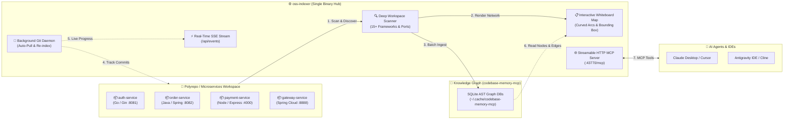

<div align="center">

# 📦 oss-indexer

**Autonomous Topology Control Plane, Architecture Map & Real-Time AST Ingestion Daemon for Microservices & Multi-Repo Workspaces**

[](https://github.com/Abbilville/oss-indexer/releases)
[](https://golang.org/)
[](https://modelcontextprotocol.io/)
[](#1-docker--docker-compose-build-from-source)
[](LICENSE)

<p align="center">
  <a href="#-quick-start-step-by-step">Quick Start</a> •
  <a href="#-web-dashboard--whiteboard-topology">Web Dashboard</a> •
  <a href="#-cli-reference">CLI Reference</a> •
  <a href="#-ai-agent--mcp-setup">MCP Setup</a> •
  <a href="#-production-deployment">Production Deploy</a> •
  <a href="#-manifest-schema-registryyaml">Manifest Schema</a> •
  <a href="#-faq--troubleshooting">FAQ</a>
</p>

</div>

---

## 🌟 Overview

`oss-indexer` is a single-binary **microservice control plane, interactive whiteboard architecture map, and background AST knowledge graph ingestion daemon**. Built in Go with zero CGO dependencies using the official [Model Context Protocol Go SDK](https://github.com/modelcontextprotocol/go-sdk), it bridges your source code, runtime service topologies, and AI pair-programmers.



---

## ⚡ Key Capabilities

- **🧠 Live AST Graph Sync**: Directly reads exact Abstract Syntax Tree (AST) node counts, call graph edges, and symbol tables from `codebase-memory-mcp` SQLite stores.
- **📋 Whiteboard Architecture Canvas**: Full infinite-canvas whiteboard experience with drag-to-pan, mouse-wheel cursor zoom, draggable nodes, and a luminous workspace boundary box.
- **🌈 Curved Multi-Edge Fan-Out**: Automatically calculates quadratic Bezier arcs so overlapping/bidirectional inter-service lines never stack.
- **⚡ Real-Time Live Streaming**: Watch indexing jobs execute in real-time across terminal stdout and the web dashboard via Server-Sent Events (`/api/events`).
- **🔍 Deep Multi-Stack Scanner**: Auto-detects Go, Java (Spring Boot / Maven / Gradle), Node.js (Express / Nest / Next), Python (FastAPI / Django), Rust, C#/.NET, and PHP along with their listening ports.
- **🤖 Standalone Daemon & HTTP MCP Server**: Runs continuously in the background, checking for Git commits and exposing standard MCP tools over HTTP.
- **🐳 Single Binary & Docker Ready**: Zero CGO dependencies, self-contained embedded web assets, and instant container deployment.

---

## 🚀 Quick Start (Step-by-Step)

### 1. Prerequisites

Make sure you have **Go (>= 1.25)** and **Node.js (>= 18)** installed on your machine.

If you don't have [`codebase-memory-mcp`](https://github.com/DeusData/codebase-memory-mcp) installed yet, install it globally via npm:

```bash
npm install -g codebase-memory-mcp
```

---

### 2. Clone and Install `oss-indexer`

```bash
# Clone repository
git clone https://github.com/Abbilville/oss-indexer.git
cd oss-indexer
```

#### Option A: Install Globally via Go (Recommended)
```bash
go install ./cmd/oss-indexer
```
*Installs `oss-indexer` directly to `$GOPATH/bin` so you can run `oss-indexer` from any directory in your terminal.*

#### Option B: Build Local Binary
```bash
# Linux / macOS
go build -o bin/oss-indexer ./cmd/oss-indexer

# Windows PowerShell / CMD
go build -o bin/oss-indexer.exe ./cmd/oss-indexer
```

---

### 3. Launch the Hub & Dashboard

Start the background daemon on default port `43770`:

```bash
# If installed globally:
oss-indexer daemon

# Or if using local binary:
./bin/oss-indexer daemon            # Linux / macOS
.\bin\oss-indexer.exe daemon        # Windows PowerShell
```

Output:
```text
[oss-indexer] Daemon started (interval: 15m0s, auto-pull: true, mode: moderate)
[oss-indexer] Dashboard UI:    http://127.0.0.1:43770/
[oss-indexer] MCP HTTP Server: http://127.0.0.1:43770/mcp
```

---

### 4. Open the Web Dashboard

Open your browser at **[http://localhost:43770/](http://localhost:43770/)**:
1. Click **"Scan New Workspace"** on the right sidebar and enter your project path (e.g. `/path/to/services` or `C:\my-project`).
2. Click **"Batch Re-index Project"** in the Action Center.
3. Watch your services get scanned, mapped into the topology whiteboard, and indexed in real-time!

---

## 📋 Web Dashboard & Whiteboard Topology

The built-in web dashboard provides an interactive control center for your microservice ecosystem:

### 1. Interactive Whiteboard Canvas
- **🖐️ Free Canvas Panning**: Click and drag anywhere on the canvas background to move freely across the canvas.
- **🔍 Cursor-Centered Zoom**: Scroll the mouse wheel over any point to zoom smoothly ($35\% - 250\%$).
- **⛶ Workspace Bounding Box**: A luminous boundary box (`⛶ WORKSPACE`) frames your architecture perimeter.
- **🎯 Constrained Node Dragging**: Drag any service node to arrange your layout; all connected curved lines update dynamically in real time.
- **⟲ One-Click Reset View**: Instantly re-centers the whiteboard and resets the zoom level to $100\%$.

### 2. Curved Multi-Edge Arcs (No Overlapping Lines)
When multiple connections connect the same pair of services (e.g. Gateway routing + Eureka discovery + direct REST calls), the engine automatically separates them into curved quadratic Bezier arcs:
- 🔵 **Solid Blue Arc**: API Gateway traffic route (`routes_to`)
- 🟣 **Dashed Purple Arc**: Service Discovery registration (`registers_with`)
- 🟢 **Cyan Arc**: Direct REST / Feign invocation (`api_call`)

### 3. Service Detail & AST Inspector Modal
Clicking on **any microservice card or topology node** opens a detail inspector:
- **🧠 AST Metrics**: Exact Indexed AST Nodes & Call Graph Edges from SQLite.
- **🔗 Communication Links**: Inbound callers and outbound dependencies.
- **🛠️ Tech Stack & Ports**: Detected frameworks, runtime ports, and local file paths.
- **⚡ Re-index Button**: Trigger an incremental re-index for just that single service.

---

## 🛠️ CLI Reference

Arguments enclosed in `[brackets]` are user-defined placeholders.

| Command | Usage | Description |
| :--- | :--- | :--- |
| `daemon` | `oss-indexer daemon [--interval 15m] [--port 43770] [--pull]` | **Primary mode**: Starts the Web Dashboard, HTTP MCP server, and background Git auto-pull watcher. |
| `onboard` | `oss-indexer onboard [workspace_path] [-p project_id] [-m mode]` | **Atomic workflow**: Scans directory, generates `registry.yaml`, and batch-indexes all repositories. |
| `scan` | `oss-indexer scan [workspace_path] [-o registry.yaml] [-p project_id]` | Scans directory up to depth 4, detects microservices/ports, and saves `registry.yaml`. |
| `index` | `oss-indexer index [-r path/to/registry.yaml] [-p project_id] [--pull]` | Triggers batch AST indexing for all repositories in the registry. |
| `status` | `oss-indexer status` | Displays daemon health, indexed repository counts, and recent run logs. |
| `remove` | `oss-indexer remove [project_id_or_path] [--no-purge-graphs]` | Decommissions project, unregisters from catalog, and purges graph DBs. |
| `run` | `oss-indexer run [--port 43770] [--stdio]` | Runs standalone MCP server via HTTP or standard I/O. |

---

## 🤖 AI Agent & MCP Setup

`oss-indexer` exposes standard [Model Context Protocol](https://modelcontextprotocol.io/) tools over Streamable HTTP (`http://localhost:43770/mcp`) or Stdio.

### Connect to Claude Desktop / Cursor / Antigravity IDE

Add `oss-indexer` to your `mcp.json` or `claude_desktop_config.json`:

#### HTTP Stream Transport (Recommended with Daemon)
```json
{
  "mcpServers": {
    "oss-indexer": {
      "url": "http://localhost:43770/mcp"
    }
  }
}
```

#### Stdio Transport (Direct Executable)
```json
{
  "mcpServers": {
    "oss-indexer": {
      "command": "oss-indexer",
      "args": ["run", "--stdio"]
    }
  }
}
```

### Available MCP Tools

| MCP Tool | Type | Inputs | Description |
| :--- | :---: | :--- | :--- |
| `get_architecture_overview` | `Read` | `project?` | Complete ecosystem topology: repos, tech stacks, ports, and inter-service edges. |
| `get_repo_details` | `Read` | `repo_name`, `project?` | Metadata, AST index status, node/edge counts, and inbound/outbound calls for a repo. |
| `get_related_repos` | `Read` | `repo_name`, `direction?` | Lists upstream callers (`inbound`), downstream dependencies (`outbound`), or `all`. |
| `list_projects` | `Read` | `project?` | Lists all registered projects in the catalog and active AST graph databases. |
| `check_project_status` | `Read` | `project?` | Freshness report showing manifest validity and per-repo indexing freshness. |
| `trigger_index` | `Write` | `project?`, `repo_name?`, `mode?`, `pull?` | Triggers immediate re-indexing for a whole project or a single repository. |
| `scan_and_create_registry` | `Write` | `workspace_path`, `output_file?` | Discovers microservices in a folder and saves `registry.yaml`. |
| `onboard_workspace` | `Write` | `workspace_path`, `project_id?`, `mode?` | Composite tool: scan $\rightarrow$ save manifest $\rightarrow$ batch index. |
| `remove_project` | `Write` | `project`, `purge_graphs?` | Decommissions project and cleans up disk artifacts. |

---

## 🐳 Production Deployment

### 1. Docker & Docker Compose (Build from Source)

#### Using Docker Compose (Recommended)
`docker-compose.yml`:
```yaml
services:
  oss-indexer:
    build:
      context: .
      dockerfile: Dockerfile
    container_name: oss-indexer
    restart: unless-stopped
    ports:
      - "43770:43770"
    environment:
      - PORT=43770
      - OSS_INDEXER_AUTH_TOKEN=${OSS_INDEXER_AUTH_TOKEN:-}
    volumes:
      - ./data:/app/data
      - oss-indexer-cache:/root/.cache/codebase-memory-mcp
      - oss-indexer-config:/root/.config/oss-mcp

volumes:
  oss-indexer-cache:
  oss-indexer-config:
```

Build and start the container:
```bash
# Build image from local Dockerfile and start in background
docker compose up --build -d

# View live indexing and daemon logs
docker compose logs -f
```

#### Using Plain Docker CLI
```bash
# 1. Build Docker image locally
docker build -t oss-indexer .

# 2. Run container on port 43770
docker run -d --name oss-indexer -p 43770:43770 oss-indexer
```

---

### 2. Linux Systemd Service (Bare Metal / VM)

To run `oss-indexer` as a permanent background service on Linux:

1. Build and copy the binary:
   ```bash
   go build -o /usr/local/bin/oss-indexer ./cmd/oss-indexer
   ```

2. Create `/etc/systemd/system/oss-indexer.service`:
   ```ini
   [Unit]
   Description=oss-indexer Microservice Hub & Daemon
   After=network.target

   [Service]
   Type=simple
   User=root
   WorkingDirectory=/root
   ExecStart=/usr/local/bin/oss-indexer daemon --port 43770 --interval 15m --pull
   Restart=always
   RestartSec=5
   Environment=PORT=43770
   Environment=OSS_INDEXER_AUTH_TOKEN=your-secret-token

   [Install]
   WantedBy=multi-user.target
   ```

3. Enable and start:
   ```bash
   sudo systemctl daemon-reload
   sudo systemctl enable --now oss-indexer
   sudo systemctl status oss-indexer
   ```

---

### 3. Reverse Proxy with Nginx & SSL (HTTPS + SSE)

When running behind Nginx, ensure **Server-Sent Events (SSE)** buffering is disabled so live real-time logs stream smoothly:

```nginx
server {
    listen 80;
    server_name topology.yourdomain.com;
    return 301 https://$host$request_uri;
}

server {
    listen 443 ssl http2;
    server_name topology.yourdomain.com;

    ssl_certificate /etc/letsencrypt/live/topology.yourdomain.com/fullchain.pem;
    ssl_certificate_key /etc/letsencrypt/live/topology.yourdomain.com/privkey.pem;

    location / {
        proxy_pass http://127.0.0.1:43770;
        proxy_set_header Host $host;
        proxy_set_header X-Real-IP $remote_addr;
        proxy_set_header X-Forwarded-For $proxy_add_x_forwarded_for;
        proxy_set_header X-Forwarded-Proto $scheme;

        # Crucial for SSE Live Progress Streaming (/api/events)
        proxy_set_header Connection '';
        proxy_http_version 1.1;
        chunked_transfer_encoding off;
        proxy_buffering off;
        proxy_cache off;
    }
}
```

---

## ⚙️ Configuration & Environment Variables

Create a `.env` file or export environment variables:

```env
# HTTP Port for Web Dashboard & MCP Server (Default: 43770)
PORT=43770

# Optional Secret Token for securing API and Dashboard
# If set, incoming requests must supply "Authorization: Bearer <token>" or "X-API-Key: <token>"
OSS_INDEXER_AUTH_TOKEN=

# Optional custom path for the machine-wide projects catalog (Default: ~/.config/oss-mcp/projects.yaml)
# MCP_PROJECTS_CATALOG=

# Optional fallback path to a custom registry.yaml
# MCP_REGISTRY_PATH=
```

---

## 📄 Manifest Schema (`registry.yaml`)

Every scanned or onboarded project produces a declarative `registry.yaml`:

```yaml
project_id: bank-microservices
name: bank-microservices Ecosystem
description: Core banking and payment processing services
source_path: /path/to/bank/registry.yaml

repos:
  - name: gateway-service
    local_path: ./services/gateway-service
    tech_stack: [Java, Spring Boot, Spring Cloud Gateway]
    entry_point: GatewayApplication.java
    port: 8888

  - name: account-service
    local_path: ./services/account-service
    tech_stack: [Java, Spring Boot, PostgreSQL, Maven]
    entry_point: AccountApplication.java
    port: 8884

  - name: discovery-service
    local_path: ./services/discovery-service
    tech_stack: [Java, Spring Boot, Netflix Eureka]
    entry_point: EurekaApplication.java
    port: 8761

relationships:
  - source: gateway-service
    target: account-service
    type: routes_to
    description: API Gateway routes incoming client traffic to account-service

  - source: account-service
    target: discovery-service
    type: registers_with
    description: account-service registers with Eureka discovery service on port 8761
```

---

## ❓ FAQ & Troubleshooting

<details>
<summary><strong>Q: Why do my microservices show "0 AST nodes" before indexing?</strong></summary>

AST nodes and call graph edges are generated when repositories are ingested into `codebase-memory-mcp`. Click **"Batch Re-index Project"** in the Action Center (or run `oss-indexer index`) to ingest all repositories into AST knowledge graphs. Once indexed, the dashboard reads the exact counts directly from SQLite.
</details>

<details>
<summary><strong>Q: How do I change the default port from 43770?</strong></summary>

You can specify `--port` in the CLI or set `PORT=5000` in your environment / `.env`:
```bash
oss-indexer daemon --port 5000
```
</details>

<details>
<summary><strong>Q: Can I run multiple projects in the same dashboard?</strong></summary>

Yes! Every project you scan or onboard is automatically registered in `~/.config/oss-mcp/projects.yaml`. Use the dropdown selector in the top navigation bar to seamlessly switch between different workspaces and microservice ecosystems.
</details>

---

## 📄 License

MIT © [Abbilville](https://github.com/Abbilville)
